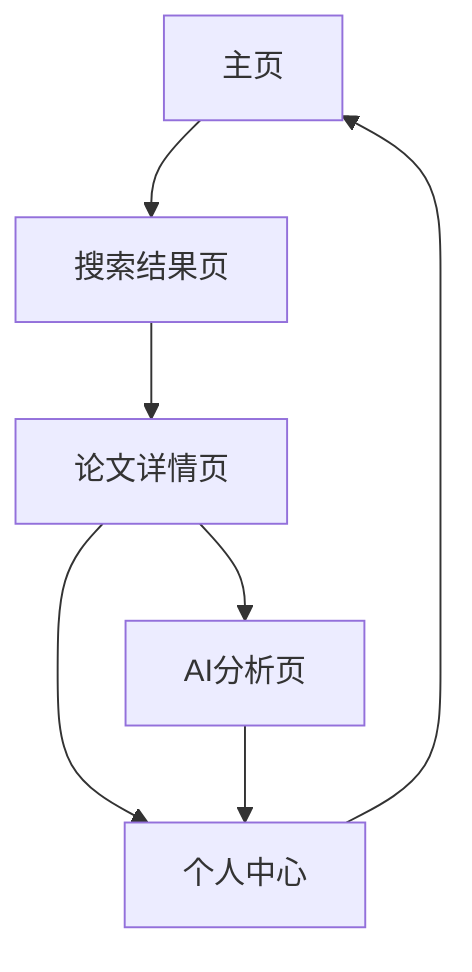

# 学术论文AI搜索助手 - PRD文档

## 1. 产品概览

学术论文AI搜索助手是一款基于人工智能技术的学术论文搜索和分析工具，旨在帮助研究人员、学生和教育工作者更高效地查找、分析和理解学术论文。

- 该产品解决了传统学术搜索工具存在的搜索结果不精准、分析能力弱、用户体验差等问题。
- 产品价值在于提高学术研究的效率和质量，帮助用户快速获取有价值的学术信息，并通过AI分析深入理解论文内容。

## 2. 核心功能

### 2.1 用户角色

| 角色 | 注册方式 | 核心权限 |
|------|----------|----------|
| 普通用户 | 邮箱注册 | 基础搜索、AI分析、保存论文 |
| 高级用户 | 付费升级 | 无限制搜索、高级AI分析、批量操作 |

### 2.2 功能模块

我们的学术论文AI搜索助手包含以下主要页面：
1. **主页**：搜索框、高级搜索选项、热门搜索、最近搜索
2. **搜索结果页**：结果列表、排序选项、筛选选项、批量操作
3. **论文详情页**：论文基本信息、摘要、全文链接、引用格式、相关论文推荐
4. **AI分析页**：核心观点提取、研究方法分析、创新点识别、技术路线图、相关研究领域
5. **个人中心**：搜索历史、保存的论文、阅读笔记、个性化设置

### 2.3 页面详情

| 页面名称 | 模块名称 | 功能描述 |
|----------|----------|----------|
| 主页 | 搜索框 | 支持关键词输入，提供搜索建议 |
| 主页 | 高级搜索选项 | 可以选择搜索范围、时间范围、学科领域等 |
| 主页 | 热门搜索 | 展示当前热门的搜索关键词 |
| 主页 | 最近搜索 | 展示用户最近的搜索历史 |
| 搜索结果页 | 结果列表 | 展示搜索结果，包括论文标题、作者、发表年份、期刊、摘要等 |
| 搜索结果页 | 排序选项 | 按相关性、发表时间、引用次数等排序 |
| 搜索结果页 | 筛选选项 | 按学科领域、发表期刊、作者等筛选 |
| 搜索结果页 | 批量操作 | 可以批量保存、下载论文 |
| 论文详情页 | 论文基本信息 | 展示标题、作者、发表期刊、发表时间、引用次数等 |
| 论文详情页 | 摘要 | 展示论文摘要内容 |
| 论文详情页 | 全文链接 | 提供论文全文的链接 |
| 论文详情页 | 引用格式 | 生成多种引用格式 |
| 论文详情页 | 相关论文推荐 | 基于当前论文推荐相关的论文 |
| AI分析页 | 核心观点提取 | AI提取的论文核心观点 |
| AI分析页 | 研究方法分析 | AI对研究方法的分析 |
| AI分析页 | 创新点识别 | AI识别的论文创新点 |
| AI分析页 | 技术路线图 | AI生成的论文技术路线图 |
| AI分析页 | 相关研究领域 | AI推荐的相关研究领域 |
| 个人中心 | 搜索历史 | 展示用户的搜索历史记录 |
| 个人中心 | 保存的论文 | 展示用户保存的论文列表 |
| 个人中心 | 阅读笔记 | 展示用户对论文的阅读笔记 |
| 个人中心 | 个性化设置 | 用户可以设置搜索偏好、通知等 |

## 3. Core Process

### 用户搜索流程

1. 用户进入主页，在搜索框中输入关键词
2. 用户可以选择高级搜索选项，设置搜索范围、时间范围、学科领域等
3. 用户点击搜索按钮，系统展示搜索结果
4. 用户可以对结果进行排序和筛选
5. 用户点击感兴趣的论文，进入论文详情页
6. 用户可以查看论文的详细信息，并点击"AI分析"按钮查看AI分析结果
7. 用户可以将论文保存到个人中心

### 个人中心流程

1. 用户登录个人中心
2. 用户可以查看搜索历史、保存的论文、阅读笔记
3. 用户可以管理保存的论文，添加阅读笔记
4. 用户可以修改个性化设置

## 4. 用户接口设计

### 4.1 设计风格

- **主色**：蓝色 #1890ff
- **辅色**：白色 #ffffff、浅灰 #f5f5f5、深灰 #333333
- **按钮样式**：圆角矩形，有悬停效果
- **字体**：系统默认字体，标题 18px，正文 14px
- **布局样式**：响应式布局，卡片式设计，有适当的间距和阴影
- **图标样式**：线性图标，简洁现代

### 4.2 页面设计概览

| 页面名称 | 模块名称 | UI元素 |
|----------|----------|--------|
| 主页 | 搜索框 | 居中大搜索框，支持输入建议 |
| 主页 | 高级搜索选项 | 下拉菜单，包含多个选项 |
| 主页 | 热门搜索 | 标签云形式展示 |
| 主页 | 最近搜索 | 列表形式展示 |
| 搜索结果页 | 结果列表 | 卡片式设计，包含论文基本信息 |
| 搜索结果页 | 排序选项 | 下拉菜单 |
| 搜索结果页 | 筛选选项 | 侧边栏，包含多个筛选条件 |
| 搜索结果页 | 批量操作 | 顶部工具栏，包含批量操作按钮 |
| 论文详情页 | 论文基本信息 | 标题、作者、期刊等信息，排版清晰 |
| 论文详情页 | 摘要 | 文本区域，可展开/收起 |
| 论文详情页 | 全文链接 | 按钮，点击跳转到全文 |
| 论文详情页 | 引用格式 | 下拉菜单，选择不同引用格式 |
| 论文详情页 | 相关论文推荐 | 卡片式设计，展示推荐论文 |
| AI分析页 | 核心观点提取 | 文本区域，突出显示核心观点 |
| AI分析页 | 研究方法分析 | 文本区域，包含图表 |
| AI分析页 | 创新点识别 | 列表形式，突出显示创新点 |
| AI分析页 | 技术路线图 | 图表展示 |
| AI分析页 | 相关研究领域 | 标签云形式展示 |
| 个人中心 | 搜索历史 | 列表形式，包含搜索关键词和时间 |
| 个人中心 | 保存的论文 | 列表形式，包含论文标题和保存时间 |
| 个人中心 | 阅读笔记 | 文本编辑器，支持富文本 |
| 个人中心 | 个性化设置 | 表单形式，包含多个设置选项 |

### 4.3 自适应

- 桌面端：完整功能，多列布局
- 平板端：保持核心功能，适当调整布局
- 移动端：简化功能，单列布局，优化触摸交互
