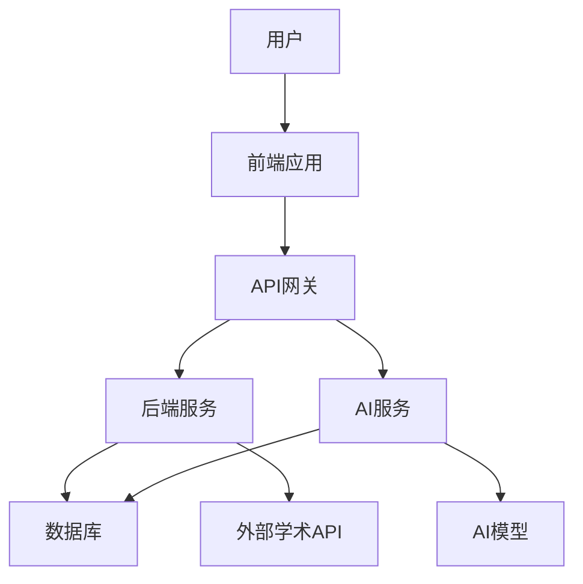

# 学术论文AI搜索助手 - 技术架构图

## 1. 整体架构

学术论文AI搜索助手采用微服务架构，由前端、后端和AI服务三大部分组成。前端负责用户界面和交互，后端负责业务逻辑和数据处理，AI服务负责论文分析和智能推荐。

## 2. 前端架构

前端采用现代Web技术栈，包括React、TypeScript、Redux等，实现响应式设计，支持不同设备的访问。

### 2.1 技术栈

- **框架**：React 18
- **语言**：TypeScript
- **状态管理**：Redux Toolkit
- **UI库**：Material-UI
- **路由**：React Router
- **HTTP客户端**：Axios
- **样式**：CSS-in-JS (styled-components)
- **构建工具**：Vite

### 2.2 模块划分

| 模块 | 功能 |
|------|------|
| 搜索模块 | 处理搜索输入和搜索结果展示 |
| 论文详情模块 | 展示论文的详细信息 |
| AI分析模块 | 展示AI对论文的分析结果 |
| 个人中心模块 | 管理用户的搜索历史和保存的论文 |
| 认证模块 | 处理用户登录和注册 |

## 3. 后端架构

后端采用Python FastAPI框架，提供RESTful API接口，处理业务逻辑和数据管理。

### 3.1 技术栈

- **语言**：Python 3.9+
- **Web框架**：FastAPI
- **数据库**：PostgreSQL
- **缓存**：Redis
- **认证**：JWT
- **ORM**：SQLAlchemy
- **消息队列**：RabbitMQ

### 3.2 模块划分

| 模块 | 功能 |
|------|------|
| 用户模块 | 处理用户注册、登录、个人信息管理 |
| 搜索模块 | 处理搜索请求，调用搜索引擎和外部API |
| 论文模块 | 管理论文数据，包括保存、收藏、分享等 |
| 分析模块 | 调用AI服务进行论文分析 |
| 推荐模块 | 基于用户行为和论文相关性提供推荐 |

## 4. AI服务架构

AI服务采用微服务架构，独立部署，通过API与后端服务通信。

### 4.1 技术栈

- **语言**：Python 3.9+
- **框架**：FastAPI
- **AI模型**：BERT、GPT、Sentence-BERT等
- **向量数据库**：Milvus
- **缓存**：Redis

### 4.2 模块划分

| 模块 | 功能 |
|------|------|
| 文本分析模块 | 提取论文的核心观点、研究方法、创新点等 |
| 语义搜索模块 | 实现基于语义的论文搜索 |
| 推荐模块 | 基于论文内容和用户行为提供个性化推荐 |
| 技术路线图生成模块 | 生成论文的技术路线图 |

## 5. 数据库设计

### 5.1 主要表结构

**用户表 (users)**
| 字段名 | 数据类型 | 描述 |
|--------|----------|------|
| id | UUID | 用户ID |
| email | VARCHAR | 邮箱 |
| password_hash | VARCHAR | 密码哈希 |
| name | VARCHAR | 用户名 |
| created_at | TIMESTAMP | 创建时间 |
| updated_at | TIMESTAMP | 更新时间 |

**论文表 (papers)**
| 字段名 | 数据类型 | 描述 |
|--------|----------|------|
| id | UUID | 论文ID |
| title | VARCHAR | 标题 |
| authors | TEXT | 作者 |
| abstract | TEXT | 摘要 |
| journal | VARCHAR | 期刊 |
| publish_date | DATE | 发表日期 |
| citation_count | INTEGER | 引用次数 |
| doi | VARCHAR | DOI |
| full_text_url | VARCHAR | 全文链接 |
| created_at | TIMESTAMP | 创建时间 |
| updated_at | TIMESTAMP | 更新时间 |

**搜索历史表 (search_history)**
| 字段名 | 数据类型 | 描述 |
|--------|----------|------|
| id | UUID | 记录ID |
| user_id | UUID | 用户ID |
| keyword | VARCHAR | 搜索关键词 |
| filters | JSONB | 搜索筛选条件 |
| created_at | TIMESTAMP | 搜索时间 |

**收藏表 (favorites)**
| 字段名 | 数据类型 | 描述 |
|--------|----------|------|
| id | UUID | 记录ID |
| user_id | UUID | 用户ID |
| paper_id | UUID | 论文ID |
| created_at | TIMESTAMP | 收藏时间 |

**笔记表 (notes)**
| 字段名 | 数据类型 | 描述 |
|--------|----------|------|
| id | UUID | 记录ID |
| user_id | UUID | 用户ID |
| paper_id | UUID | 论文ID |
| content | TEXT | 笔记内容 |
| created_at | TIMESTAMP | 创建时间 |
| updated_at | TIMESTAMP | 更新时间 |

**分析结果表 (analysis_results)**
| 字段名 | 数据类型 | 描述 |
|--------|----------|------|
| id | UUID | 记录ID |
| paper_id | UUID | 论文ID |
| core_points | TEXT | 核心观点 |
| research_method | TEXT | 研究方法分析 |
| innovations | TEXT | 创新点 |
| tech_roadmap | TEXT | 技术路线图 |
| related_fields | TEXT | 相关研究领域 |
| created_at | TIMESTAMP | 分析时间 |

## 6. API设计

### 6.1 认证API

| 端点 | 方法 | 功能 |
|------|------|------|
| /api/auth/register | POST | 用户注册 |
| /api/auth/login | POST | 用户登录 |
| /api/auth/refresh | POST | 刷新token |
| /api/auth/logout | POST | 用户登出 |

### 6.2 搜索API

| 端点 | 方法 | 功能 |
|------|------|------|
| /api/search | GET | 搜索论文 |
| /api/search/advanced | POST | 高级搜索 |
| /api/search/history | GET | 获取搜索历史 |
| /api/search/history | DELETE | 清除搜索历史 |

### 6.3 论文API

| 端点 | 方法 | 功能 |
|------|------|------|
| /api/papers/{id} | GET | 获取论文详情 |
| /api/papers/{id}/analysis | GET | 获取论文分析结果 |
| /api/papers/{id}/citation | GET | 获取论文引用格式 |
| /api/papers/{id}/related | GET | 获取相关论文 |

### 6.4 用户API

| 端点 | 方法 | 功能 |
|------|------|------|
| /api/users/me | GET | 获取当前用户信息 |
| /api/users/me | PUT | 更新用户信息 |
| /api/users/me/favorites | GET | 获取用户收藏的论文 |
| /api/users/me/favorites/{paper_id} | POST | 收藏论文 |
| /api/users/me/favorites/{paper_id} | DELETE | 取消收藏论文 |
| /api/users/me/notes | GET | 获取用户的笔记 |
| /api/users/me/notes/{paper_id} | POST | 添加笔记 |
| /api/users/me/notes/{paper_id} | PUT | 更新笔记 |
| /api/users/me/notes/{paper_id} | DELETE | 删除笔记 |

## 7. 部署方案

### 7.1 本地开发

- 使用Docker Compose启动所有服务
- 前端：`npm run dev`
- 后端：`python -m uvicorn app.main:app --reload`
- AI服务：`python -m uvicorn ai.main:app --reload`

### 7.2 生产部署

- 使用Kubernetes进行容器编排
- 前端部署到CDN
- 后端和AI服务部署到云服务器
- 数据库使用托管服务
- 定期备份数据

## 8. 技术挑战与解决方案

### 8.1 技术挑战

1. **海量论文数据的处理**：学术论文数量庞大，需要高效的存储和检索方案
2. **AI分析的性能**：AI分析需要大量计算资源，可能影响用户体验
3. **搜索精度**：如何提高搜索结果的相关性和准确性
4. **系统可扩展性**：如何支持不断增长的用户量和论文库

### 8.2 解决方案

1. **使用向量数据库**：Milvus向量数据库可以高效存储和检索论文的语义向量
2. **异步处理**：AI分析任务采用异步处理，不阻塞用户请求
3. **混合搜索**：结合关键词搜索和语义搜索，提高搜索精度
4. **微服务架构**：采用微服务架构，便于横向扩展
